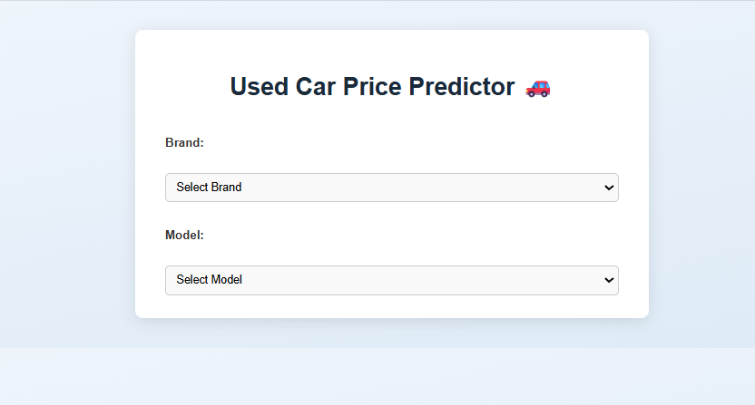
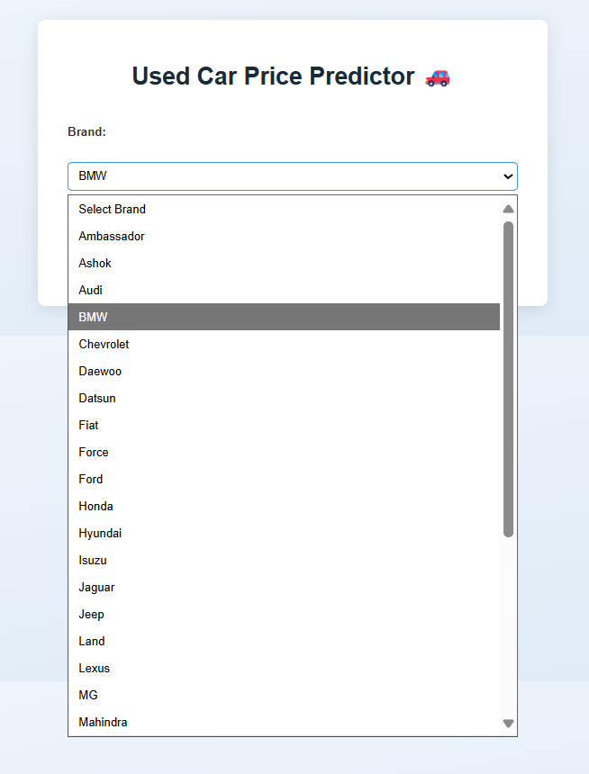
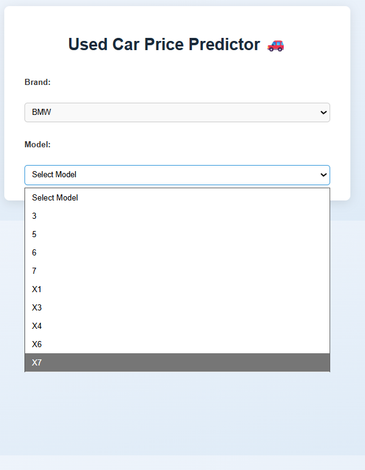
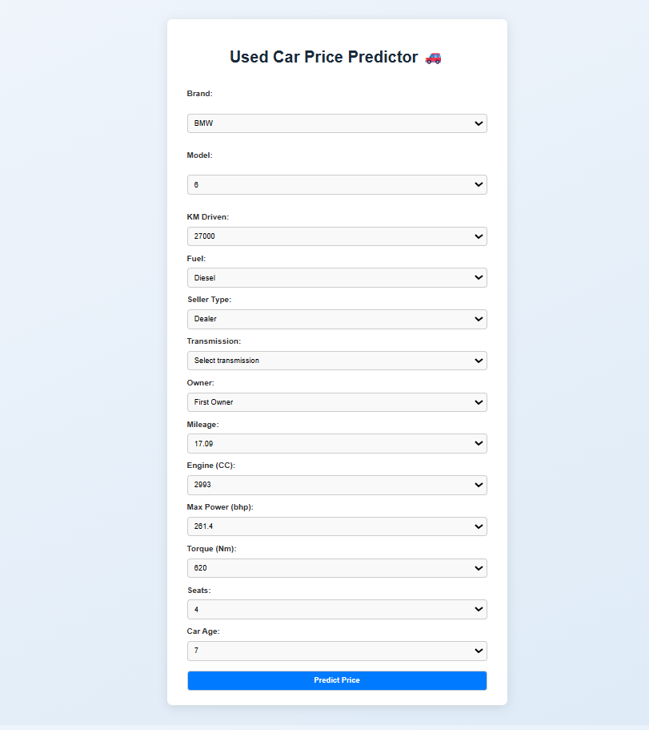
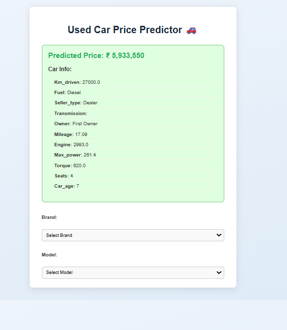

🚗 Used Car Price Predictor
A Machine Learning-based web application built with Flask that predicts the resale price of a used car based on historical data. Users simply select Brand and Model, and the app dynamically shows only the valid configurations from the dataset. It then displays:

The predicted price

The full car details (mileage, fuel type, transmission, etc.)

📌 Features
✅ Predict resale value of a car
✅ Dynamic form: brand → model → auto-fill possible valid options
✅ Show complete car details along with the predicted price
✅ Clean, responsive frontend using HTML, CSS, and JavaScript
✅ Pre-trained ML model with RandomForestRegressor
✅ Well-structured and scalable codebase

📂 Project Structure

used-car-price-predictor/
├── app/
│ ├── templates/
│ │ └── index.html
│ ├── static/
│ │ └── style.css
│ └── app.py
├── data/
│ └── car_data.csv
├── models/
│ └── best_model.pkl
├── images/
│ ├── MainPage.png
│ ├── SelectBrand.png
│ ├── SelectModel.png
│ ├── OtherOptionsAutomaticByDataset.png
│ └── FinalPricePredictionWithAllDetails.png
├── requirements.txt
├── UsedCarPricePrediction.ipynb
└── README.md

⚙️ Tech Stack
Backend: Python, Flask

Frontend: HTML5, CSS3, JavaScript, jQuery

ML Model: Scikit-Learn (Random Forest Regressor)

Tools: VS Code, Jupyter, Pandas, NumPy

📦 Installation & Setup

1) Clone the repo:

git clone https://github.com/Yash-7670/used-car-price-predictor.git
cd used-car-price-predictor

2) Create a virtual environment:

python -m venv venv
source venv/bin/activate       # On Linux/Mac
venv\Scripts\activate          # On Windows

3) Install dependencies:

pip install -r requirements.txt

4) Run the Flask app

cd app
python app.py

5) Open browser and visit:

http://127.0.0.1:5000

## Dependencies

The required Python packages are listed in `requirements.txt`. Install them using pip.

## Dataset

The dataset `used_cars.csv` contains information about used cars and their features. It is located in the `data/` directory.

## Notebook

The Jupyter Notebook `UsedCarPricePrediction.ipynb` contains the exploratory data analysis, preprocessing steps, and model training process.

## Model

The trained model is saved as `best_model.pkl` in the `models/` directory.

## Application

The Flask application is located in the `app/` directory. It provides a user interface to input car details and get price predictions.

## 📸 Screenshots

### 🏠 Main Page

### 🚗 Select Brand

### 🚙 Select Model

### ⚙️ Auto-Filled Options Based on Dataset

### 💰 Final Prediction with All Details
